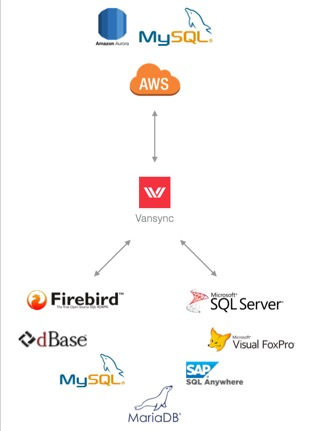

# Vansync
Vansync is a database synchronization tool for continually moving data from on-premises to AWS Aurora MySQL and back forward.
Created to keep your legacy databases on-premises while providing a simple way to extract, load & transform specific sets of data to AWS Aurora.

**Sources:**

* Firebird SQL
* dBase (DBF)
* Visual FoxPro (VFP)
* Sybase (SAP SQL Anywhere)
* Microsoft SQL Server (MSSQL)
* MySQL

**Destination:**

* Amazon Aurora MySQL

# Link your AWS Account to Vansync API

This CloudFormation template will link your AWS Account to Vansync API.
*A CloudFormation template is an automated script to create and configure AWS resources.*

These instructions assume that you already have:
1. An active AWS account.
2. Sent to [info@factorbi.com](mailto:info@factorbi.com) your **AWS Account ID** and **Canonical User ID.**
3. Received from Factor BI your **bucket name.**

If you are not sure about these requirements please visit the [documentation page.](https://factorbi.github.io/)

## Provision the AWS services

### Before you start
1. Have at hand your **bucket name.** It must look like this: `vansync-123456789012`
2. Log in to your AWS account.

**IMPORTANT NOTICE: If you are planning to use the following AWS resources for production you may want to follow your company policies and understand how to use AWS security according to your needs.**

### 1. Launch the Stack

Select the closest region to your location and click **Launch Stack.**
If you want to use another region, just select it after the template initiates on your browser.

| AWS Region | Short name | |
| -- | -- | -- |
| US East (N. Virginia) | us-east-1 |  |
| US East (Ohio) | us-east-2 |  |

### 2. Create Stack

* The Amazon S3 URL template must be already selected, click **Next** lower-right orange button.

### 3. Specify stack details
* **Stack Name:** this will be the prefix of all provisioned services.  Example: `mycompany-prod`
* **BucketName:** Paste the S3 bucket name that your received from Factor BI over email. It must look like this: `vansyncdata-123456789012`
* **DBAdminPassword:** Type a complex password. Must be at least 8 characters containing uppercase and lowercase letters, numbers and symbols. Password must be at least eight characters long. Can be any printable ASCII character except "/", """, or "@".**
* **DBAdminUsername:** Database Admin Username, example: root
* **DBInstanceClass:** for testing purposes select the smallest available, currently db.t4g.medium.
* **Environment:** Text string to be included in the database cluster hostname.
* **PublicSubnetACIDR:** Leave default. Only modify the subnet address if multiple environments are needed, example: `10.20.10.0/24`
* **PublicSubnetBCIDR:** Leave default. Only modify the subnet address if multiple environments are needed, example: `10.20.20.0/24`
* **SubnetsAZ:** Select three availability zones to create the resources.
* **VPCCIDR:** Leave default. Only modify the address if multiple environment are needed, example: `10.20.0.0/16`
* Click **Next**, orange button.

### 4. Configure stack options
* Leave all defaults, many in blank.
* Scroll down to Capabilities.
* Check "I acknowledge that AWS CloudFormation might create IAM resources with custom names".
* Click **Next**, orange button.

### 5. Review and create

* Scroll down, review all details.
* Click **Submit** orange button. 
* CloudFormation will start to deploy the services.

### 6. Resources created

* Check Stack Name.
* Review **Events** tab while Status is CREATE_IN_PROGRESS.
* Once Status is CREATE_COMPLETE review **Outputs** tab.
* You may want to copy and save on a secure place all Outputs, as you will use them for further configuration.

## License

Licensed under [MIT License.](LICENSE.md)
